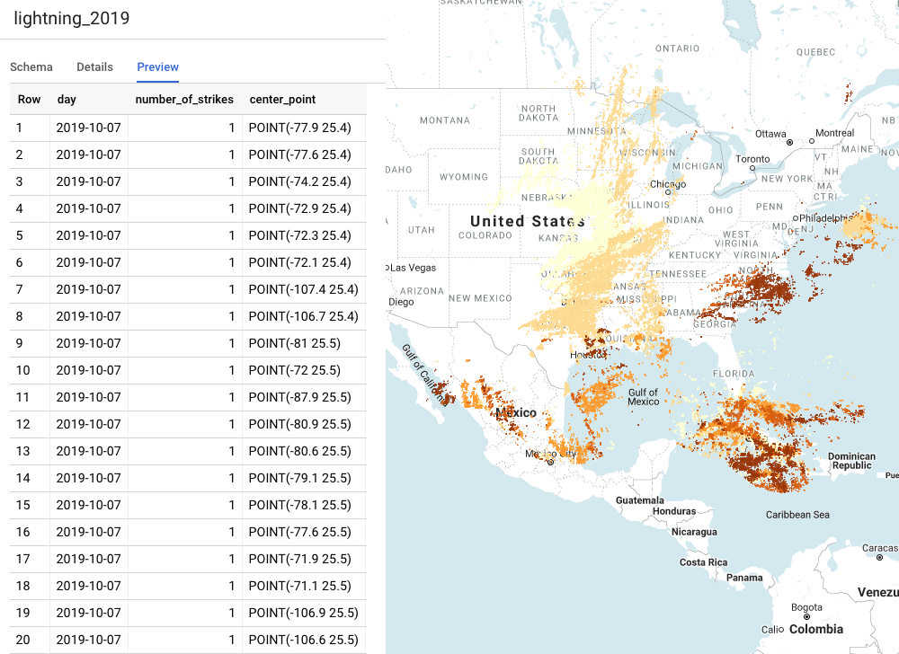
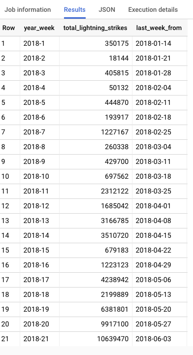
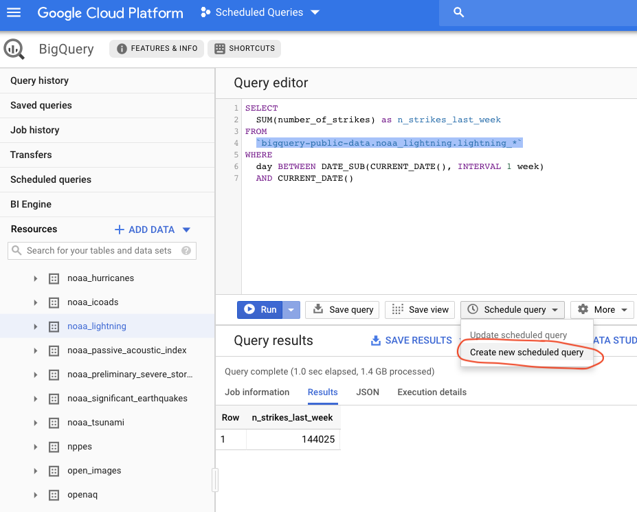
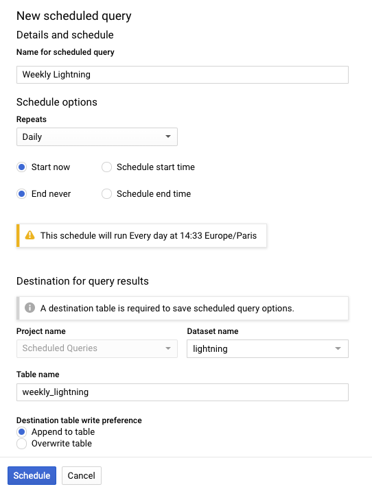
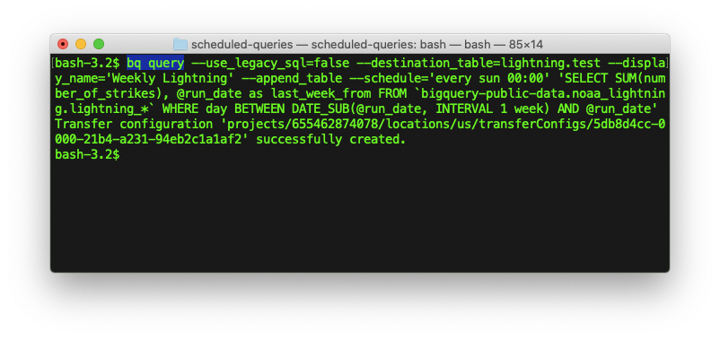

# Setting up production ready scheduled queries for Big Query on GCP 

# Introduction

While creating a scheduled query is quite easy, there are a few things you need to consider when making and deploying a scheduled query for production. This article will go over different ways of setting up scheduled queries and how well each is suited for production ready systems.

## What is needed of a production ready scheduled query deployment

1. **The schedule of the query.**
This one might seem obvious, but if we can't define at what time the query is to run, we can't schedule a query.

2. **First run of the query.**
By default, a scheduled query will run as soon as you create it. This has the potential to cause trouble.

Let's say you want weekly averages and you store the weeknumber for each average. These are to be calculated every Friday, but your first query runs immediately after it was deployed on a Wednesday: Not only will you have an average that spans a different set of days, come Friday, you will have 2 aggregates for the same week, but with different values.

3. **Query and deployment as code, in seperate files.**
Your devOps team needs a script that can deploy your query. This way the same query can be deployed across testing, development and production environments. Your developer wants to be able to edit the query in its own `.sql` file, so that their development tools can assist them during development, and so they don't have to touch deployment code when they are editing the query.

4. **Backfill, historical runs.**
You need to be able to re-run queries for past dates. If something went wrong in production and the scheduled query didn't have access to all numbers on Friday, you want to be able to re-run it on Monday *as if it was Friday*. You might also want to be able to create a report for Friday last year - long before the query was deployed.

5. **Control the schema of the destination table.**
The destination table is where the result of your scheduled query will be stored. Depending on your needs you can choose to append to this table or overwrite the table on every run. If the results produced by the scheduled query are large, and expected to run for a long time, the destination table should be partioned, so that queries against the destination table doesn't become too costly.

# About this tutorial


For this tutorial, we will imagine we are in the business of lightning strikes and management has decided that weekly aggregates of lightning strikes are critical to growth going forward.

We are also going to imagine that aggregating this data is an operation that is so heavy, that it doesn't make sense to do it on the fly.

## The data

The [National Oceanic and Atmospheric Administration (NOAA)](https://www.noaa.gov) publishes times and locations of all observed lightning strikes, and this is available as a public dataset in BigQuery. The dataset is licensed through [Vaisala](https://www.vaisala.com/en/products/data-subscriptions-and-reports/data-sets/nldn) and according to Google is [freely available to the public, under data.gov license](http://www.data.gov/privacy-policy#data_policy). The data can be accessed in BigQuery as `bigquery-public-data:noaa_lightning`-dataset.

To play with it yourself, or any of the other many public datasets available in BigQuery, open the console, click `+ ADD DATA`>`Pin Project` and pin "*bigquery-public-data*".

## The Query of interest

As a start, we use the following query, but we will expand it, as it becomes clear that this is too simple for a production environment

```SQL
SELECT
  SUM(number_of_strikes) as n_strikes
  CURRENT_DATE() as last_week_from
FROM
  `bigquery-public-data.noaa_lightning.lightning_*`
WHERE
  day BETWEEN DATE_SUB(CURRENT_DATE(), INTERVAL 1 week)
  AND CURRENT_DATE()
```

This query will return the sum of lightning strikes that happened during each lightningstrike observation between the date that the query was run, and 1 week before the query was run. If we run this weekly, we will build up a table of weekly averages. If we run it daily, we will build up a table of rolling, weekly averages.

*A note about the asterisk* The lightning table is partitioned into several tables. By querying from `lightning_*` we tell Big Query to look at all the lightning tables, instead of just the table with 2019 data (if we wrote `lightning_2019`). You can uptimize the query here, since we normally won't need to look at 2017 data to do a job on 2019 data. But just around new year, we might have queries that do span 2 tables, so be careful how you optimize. In this article, I have gone with the most straightforward solution.

## The Schedule

We want to run this every Sunday morning, 00:00Z and aggregate the past week

## The Raw data
The raw data looks like the following, and can be plotted on a map using BigQuery Geoviz



## The Destination table

The final result will be a table that displays the weekly number of lightning strikes. Each additional row is generated by the end of the week and added to the table. For this data, such a simple query can be made on the fly, but if we imagine that the results are much more complex and may span hundreds of of row for each week, you can hopefully imagine why you'd want to do it on a schedule, rather than on the fly.



---
# Using the Bigquery Console

This is by far the most straight-forward way of working with, and trying out features and services in GCP. It is a great place to start writing and testing your scheduled query, as you get a helpful IDE for writing and testing your query.

You simply write your query and and click create scheduled query and choose when and how often you want it to run.



You can run the query before you set it up, and you can easily get an overview of most of the settings available to you. You should definitely start every prototype here.



Clicking "Schedule" will run the query, create a new table, and append the result to that table. Easy as that.

## Adding Backfill

If we instead of using `CURRENT_DATE()`-function to select for the last 7 days, we use the `@run_date` runtime parameter, we can ask BigQuery to do a manual run of the scheduled query with `@run_date` substituted for any date we like, making it possible to re-run queries in the past.

Our SQL will now look like this:

```SQL
SELECT
  SUM(number_of_strikes),
  @run_date as last_week_from
FROM
  `bigquery-public-data.noaa_lightning.lightning_*`
WHERE
  day BETWEEN DATE_SUB(@run_date, INTERVAL 1 week)
  AND @run_date
```

Note that once the query is parameterised, you can no longer execute it from the console. Checks to see if the query is still valid will also often fail, making it difficult to update the query.

## Pro's and con's of the webconsole
The webconsole is great for prototyping and testing queries. It cannot be used where you need automated deployment.

**Pro's** 
- Great environment for writing and testing queries
- Can create and run scheduled queries.
- *Can* run do backfill

**Con's**
- Can't always edit or even save parameterised queries nescessary for backfill
- Cannot version control queries
- Deployment has to be done manually

---
# Using the Cloud SDK

We also want to store our SQL code in VCS and deploy the query as part of our CD/CI-pipeline. For this, it is not feasible to have a developer log on to the webconsole and manually do deployments. So we need to move away from the webconsole, in order to test the parameterised query as well as having deployment script that DevOps can automate.

One way is to use the Cloud SDK from the shell, e.g. the `gcloud` and the `bq` shell commands. Often these are the easiest and most complete ways to interact with the GCP.

According to the documentations there are 2 different commands to deploy scheduled queries, and it is not immediately clear which is preferred:

1. `bq query` followed by a commandline flags and finally the query.
2. `bq mk --transfer_config`, hooks more directly into the [BigQuery Transfer service](https://cloud.google.com/bigquery-transfer/docs/), which Scheduled Queries are a part of. Uses a mix of commandline flags and JSON.

## Using `bq query`



Our deployment command will roughly be the following, but needs a few more refinements.

```Bash
bq query \
    --use_legacy_sql=false \
    --destination_table=lightning.test \
    --display_name='Weekly Lightning' \
    --append_table \
    --schedule='every sun 00:00' \
'SELECT
  SUM(number_of_strikes),
  @run_date as last_week_from
FROM
  `bigquery-public-data.noaa_lightning.lightning_*`
WHERE
  day BETWEEN DATE_SUB(@run_date, INTERVAL 1 week)
  AND @run_date'
```

- `--use_legacy_sql` should be false, as scheduled queries can only be in standard SQL
- `--destination_table` is the name of the dataset and table seperated by a dot. This is where the result of the query will be stored. The table doesn't need to exist - it will be automatically created - but the dataset must exist.
- `--display_name` is the name of the query. This is not a unique name and it is not an ID.

### Remember the schedule flag

Note that if you forget the `--schedule`-flag (as [Google did in their example code](https://cloud.google.com/bigquery/docs/scheduling-queries#setting_up_a_scheduled_query), at the time of writing) you will be met with a very cryptic error:

```
Error in query string: Error processing job 'scheduled-queries:bqjob_r3159aed97aa830f5_0000016dd9faa75c_1':
Undeclared parameter 'run_date' is used assuming different types (DATE vs INT64) at [3:3]
```

This is because without the `--schedule` flag, the `@run_time` SQL-parameter will not have a value, so BigQuery will fail at type-checking the query. It will first assume the empty parameter must be an INT64 in line 3, `@run_date as last_week_from` and then later sees that it is used as a date.

This is the same error that causes you to be unable to save edits this query in the webconsole.

### The interval format of the schedule flag

Another under-documented feature here is what values are accepted by the `--schedule` flag. It follows the [App-engine flexible environment's cron.yaml-syntax](https://cloud.google.com/appengine/docs/flexible/python/scheduling-jobs-with-cron-yaml#the_schedule_format). The easiest way to create these is to use the webconsole to create the desired scheduled, and then inspect the final result in the completed schedule under the configuration tab.

### Don't use false for either append or replace flags

Both the `--append_table` and `--replace` are shown in the documentation as taking a `true` value. This is strictly not necessary, you don't need to write `--replace=true` if you want to truncate the table everytime the job is run, and if you don't want the table truncated, you actually cannot write `--replace=False`.

- Add the `--replace` flag for replacing tables (What BQ Transfer internally calls WRITE_TRUNCATE as your write_disposition value)
- Add the `--append_table` flag if you want to append to the destination table (What BQ Transfer internally calls WRITE_APPEND as your write_disposition value)
- If you add both flags or none of them, you will append.

## Working with an external .sql file

We want the deployment command seperated from the .sql file. A simple solution in BASH is to move the SQL-code into `weekly.sql` file and cat the content into the `bq query` command inside the deployment script, `deploy_query.sh`

```bash
# deploy_query.sh

bq query \
    --use_legacy_sql=false \
    --destination_table=lightning.test \
    --display_name='Weekly Lightning' \
    --append_table \
    --schedule='every sun 00:00' \
    `cat weekly.sql`
```

```sql
- weekly.sql

SELECT
  SUM(number_of_strikes),
  @run_date as last_week_from
FROM
  `bigquery-public-data.noaa_lightning.lightning_*`
WHERE
  day BETWEEN DATE_SUB(@run_date, INTERVAL 1 week)
  AND @run_date
```

## Backfill

To run the query on historical dates we use `bq mk`, to create a transfer run.

```bash
bq mk \
    --transfer_run \
    --start_time='start_time' \
    --end_time='end_time' \
    [resource_name]
```

Using the `--end_time`-flag we can schedule multiple backfills within a given timeframe. E.g., we can backfill all weekly lightning strikes for 2018.

However, we don't know the name of the newly created query ressource! 

The ressource name is returned by the `bq query` command on success and looks something like

```bash
Transfer configuration 'projects/655462874078/locations/us/transferConfigs/5dafef56-0000-2a29-a894-f4f5e80c659c' successfully created.
```

and we can cut it out with a bit of more bash

```bash
# deploy_query.sh

bq query \
    --use_legacy_sql=false \
    --destination_table=lightning.test \
    --display_name='Weekly Lightning' \
    --append_table \
    --schedule='every sun 00:00' \
    `cat weekly.sql`| tee /dev/tty | cut -d "'" -f 2 > resource_name.txt
```

Here the result of the query deployment is piped to [tee](https://en.wikipedia.org/wiki/Tee_(command)), where we can save it to our logs (or in this example, just print it to the terminal), and then pipe the original result to the [cut](https://en.wikipedia.org/wiki/Cut_(Unix)) utility, which will cut it into fields on the single quotation mark, and we save the second field, containing the resource name, to the filesystem.

```bash
# backfill.sh

start_time=@1
end_time=@2

bq mk \
    --transfer_run \
    --start_time=$start_time \
    --end_time=$end_time \
    `cat resource_name.txt`
```

## Pro's and con's of `bq query` way of deployment

Using Google's Cloud SDK we can create a deployment with seperate SQL and deployment files that can be stored in version control and deploy on different environments. We can run backfill on historical dates.

We can not control the schema of the destination table. One workaround is to create the table in a seperate command in `deploy_query.sh`, but this requires that the developer to write the schema by hand. Not impossible, but combersome and requires a lot of testing.

We also cannot control when the first query is run. With `bq query ...` command, the query will run immediately and save rows to the destination table. A workaround could be to follow the deployment with a query that deletes all rows after the first run, so that over time, only data from the scheduled events (and backfills) will exist in the destination table. Also not impossible, but not particularly elegant.

**Pro's** 
- Code is seperated into query and deployment
- Can be versioned and automatically deployed across environments
- Can run do backfill

**Con's**
- Can't control the schema of the destination table - no possibility for setting partioning fields
- Query will always run immediately on deployment.

## Using `bq mk --transfer_config`


This command mimics more directly the transfer service API. Most flags corrosponds to a field in the [TransferConfig Resource](https://cloud.google.com/bigquery-transfer/docs/reference/datatransfer/rest/v1/projects.locations.transferConfig), although this isn't completely one-to-one.

Moreover, this command uses a mix of commandline flags and in-line JSON. From the perspective of someone who wants to deploy a scheduled query, it is not obvious what kind of information goes into the JSON and what should be a commandline flag. But roughly speaking the JSON describes the destination table, and the flags describes the schedule. In this context, the query should be thought of as a description of the layout of the table (the result of a query *is* a table). An overview of all available parameters are not documented anywhere.

Let us start with a simplified command, and try and expand it.

```bash
bq mk --transfer_config \
    --target_dataset=lightning \
    --display_name='Weekly Lightning' \
    --params='{"query":"SELECT 1 from mydataset.test","destination_table_name_template":"test","write_disposition":"WRITE_APPEND", "partitioning_field": "last_week_from"}' \
    --schedule=schedule-string \
    --schedule_start_time=datetime \
    --data_source=scheduled_query
```

The documentation for all the flags and parameters used are scattered between the `bq mk --help` command, the [scheduled query documentation page](https://cloud.google.com/bigquery/docs/scheduling-queries) and the [TransferConfig Resource documentaion page](https://cloud.google.com/bigquery-transfer/docs/reference/datatransfer/rest/v1/projects.locations.transferConfig).


*Note* 
- `--data_source` flag *must* be "scheduled_query", or else we are not creating a scheduled query.
- `--schedule_start_time`: "Time to start scheduling transfer runs for the given transfer configuration. If empty, the default value for the start time will be to run immediately. The format for the time stamp is [RFC3339 UTC "Zulu".](https://developers.google.com/protocol-buffers/docs/reference/google.protobuf#google.protobuf.Timestamp)" - manpage for `bq mk`
- `destination_table_name_template` is generally just the table name. If you want every run to be stored in a seperate table, you can also supply a templated name and later query across a subset of tables. Generally it is recommended to use partioned fields for this type of functionality.

### Start time

If we don't supply a start time, the query will run as soon as we deploy it. If we deploy on Thursday, we will suddenly have a summary for the wrong timespan, since we expect weekly summaries Sunday-Sunday.

We can change when the first run of the schedule is, by using the `--schedule_start_time`-flag. However, unlike its name or man-page description, this flag doesn't specify *when* the first run is, it specifies a time which the schedule must run no sooner than. Simply supplying the current time will get you what you want, just remember to convert it to UTC.

If you are on a BSD system (such as MacOS) or a GNU system (such as Linux) the `date` program will behave very differently, but for displaying the current time in UTC "Zulu", it works out just the same.

```bash
date -u +%Y-%m-%dT%TZ
```

### Partitioning the destination table

It is generally a good idea to partition your tables. This makes it possible to drastically reduce the size of your queries later on. This is not possible to do, when using the `bq query`-command. Which column to partition on is defined in the `partitioning_field`-field inside the JSON parameters.

### Splitting out the query and writing the deployment files

In terms of splitting this command into a SQL-file, a deployment script and a backfill script, the major hurdly is to insert the SQL query string into the JSON string and the JSON string into the `bq mk` command.

If we naively `cat` the sql-query directly into the json string,

```bash
...
    --params='{"query":"'`cat weekly.sql`'","destination_table_name_template":"test2","write_disposition":"WRITE_APPEND"}' \
...
```

We will get a FATAL error:

```
FATAL Flags positioning error: Flag '--schedule=every' appears after final command line argument. Please reposition the flag.
Run 'bq help' to get help.
```

This is because of the line breaks that `cat` prints from the file. In bash, if you echo a variable with quotes, it will retain new lines, but if you don't quote the variable, it will have newlines removed. Using this, we can split the loading of the query and the json construction into seperate operations and get:

```bash
# deploy_query-transfer_config.sh

query=`cat weekly.sql`
json='{
"destination_table_name_template" : "test",
"write_disposition": "WRITE_APPEND",
"partitioning_field": "last_week_from",
"query": "'${echo $query}'"
}'

bq mk --transfer_config \
    --target_dataset=lightning \
    --display_name='Weekly Lightning' \
    --schedule='every sunday 00:00' \
    --schedule_start_time="`date -u +%Y-%m-%dT%TZ`" \
    --data_source=scheduled_query \
    --params="$json" \
| tee /dev/tty | cut -d "'" -f 2 > resource_name.txt
```

This will also work with quotes inside of the SQL query. Here we also store the resource name, just like we did with the `bq query` command, and backfill can be done just like earlier.

### Backfill

This is done just as we did previously.

## Pro's and con's of the webconsole
The webconsole is great for prototyping and testing queries. It cannot be used where you need automated deployment.

**Pro's** 
Can control almost all aspects of the scheduled query
- The schedule of the query
- The first run of the query
- backfill
- Schema of the destination table

**Con's**
- Documentation is lacking
- Deployment scripts can get complicated

# Expanding the query

Lastly, we can do a few things with the query to better ensure data-integrity down the line

```sql
- weekly_final.sql

DECLARE run_date DATE DEFAULT @run_date;

WITH t AS (
  SELECT
    CONCAT(CAST(EXTRACT(YEAR FROM CURRENT_DATE()) AS STRING), '-', CAST(EXTRACT(ISOWEEK FROM CURRENT_DATE()) AS STRING)) as year_week,
    SUM(number_of_strikes),
    run_date as last_week_from,
    CURRENT_DATETIME() as query_execution_time
  FROM
    `bigquery-public-data.noaa_lightning.lightning_*`
  WHERE
    day BETWEEN DATE_SUB(run_date, INTERVAL 1 week)
    AND run_date
)
SELECT * FROM t WHERE EXTRACT(DAYOFWEEK FROM run_date) = 1
```

The `@run_date` SQL-parameter has been moved to the top and stored as a SQL-variable. This makes it easier to test and develop the query using the BigQuery webconsole. This way, you only have to substitute "@run_date" once with any date you want to test on, in order to have the query work in the webconsole. And when you are happy with the new query, there is only one place where you need to change back to "@run_date".

`query_execution_time`-column has been added. This will tell analysts if a row was created using back-fill and when.

`year_week`-column is added to make it easier to filter on a specific week or to group by week numbers.

A constraint on the query has also been added, so that the query will only return results if it is asked to run or backfill on a Sunday. For this type of scheduled query that builds up rows over time, the integrity of the destination table is dependant on all rows being generated on a similar interval (the previous week, from every Sunday) and you need guards in place to ensure this integrity. 

The downside of having it only in SQL is that it will fail silently. You can also add such a constraint to the deployment script. The important thing is that fences are added.

# Links

- [Scheduled Queries documentation](https://cloud.google.com/bigquery/docs/scheduling-queries)
- [BigQuery Transfer documentation](https://cloud.google.com/bigquery-transfer/docs/working-with-transfers)
- [BigQuery Transfer's client library documentation](https://cloud.google.com/bigquery-transfer/docs/reference/libraries#client-libraries-usage-python)
